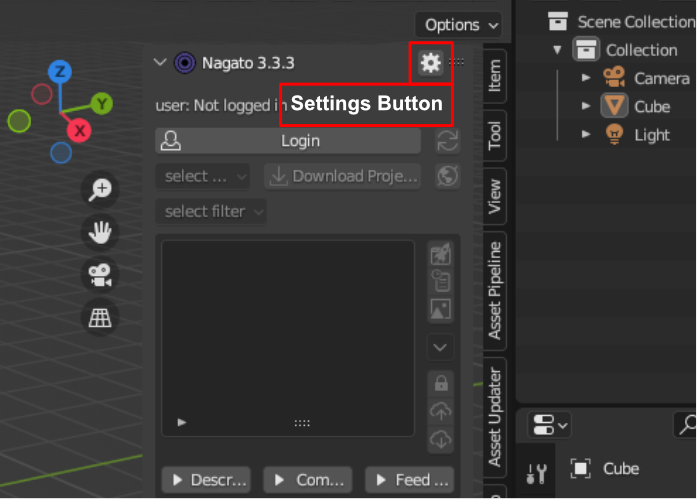
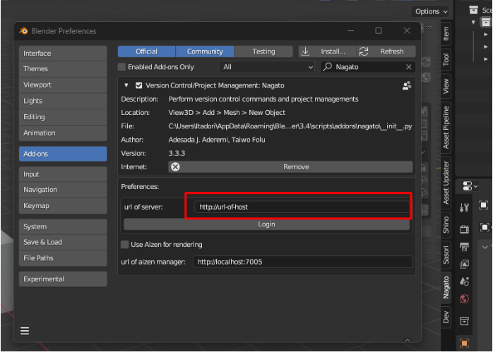
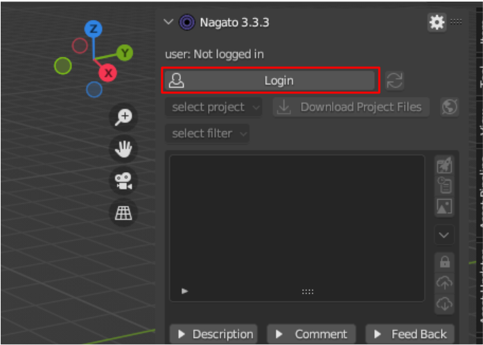
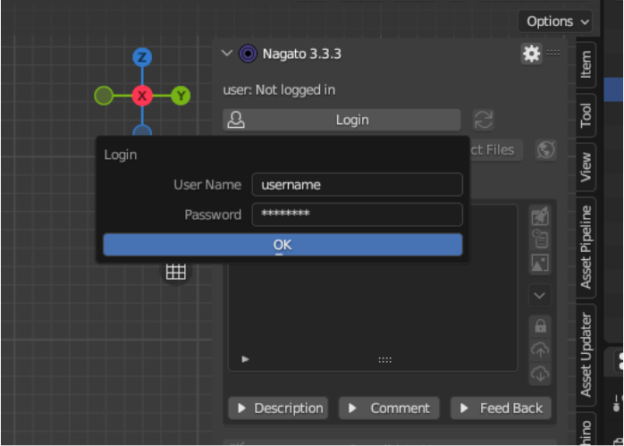
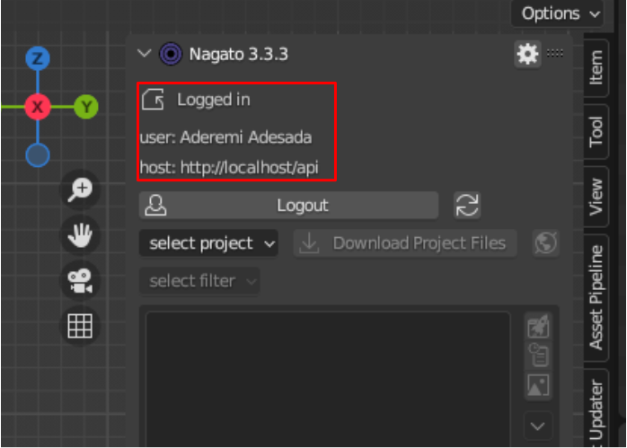
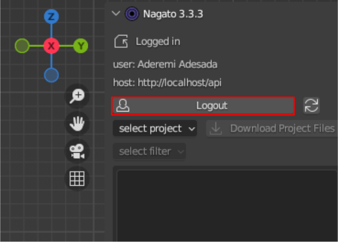

.. _authentication:

Authentication
===============

Configuring The Path to the Server
-----------------------------------
click on the setting button to go to nagato preference

enter the url to your server in the "url of server field"

|

Loging In
-----------

after inputing your server url, close the preference screen and click the login button

enter your username and password, then click ok

if login is sucessful you will be presented with your login info

|

Loging Out
-----------

to logout click the logout button

